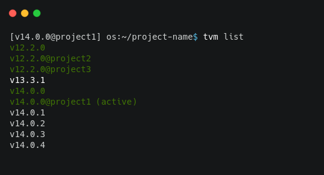

Tutor Environment Manager
#########################

Tutor environment manager allows you to create one project and set one version for it.

**Note:** You can continue using the `tutor version manager`_ commands in your project. Example: ``tvm list``, ``tvm plugins list``.

.. contents:: **Table of contents**
   :depth: 1
   :local:
   :backlinks: none

Creating a project
------------------

To create a new project you should call ``tvm project init``, this configures a new tvm project in the current path and set your-project as ``TUTOR_ROOT`` and ``TUTOR_PLUGINS_ROOT``.  

You can create different projects with the same tutor version, you have 2 options:

**Note:** You could use ``tvm project init project-name``, now TVM will create a new folder with that name and in this folder host the project.

If ``project-name`` isn't specified TVM will create a project in the current folder and configure it with that name.

- Use the global active version.

.. code-block:: bash  
    
    # Using the global active version
    
    tvm project init project-name
    
- Use a specific installed version. 

.. code-block:: bash  
    
    # Specify the version
    
    tvm project init project-name v14.0.0
    

Activate / Deactivate a project
-------------------------------

**Activate**

This will active a virtualenv with python, pip, and tutor. To activate a project you should run:

.. code-block:: bash
    
    source .tvm/bin/activate
    
    # Verify your environment is active [version@project]
    # That shoud look like: 
    
    [v14.0.0@project-name] os:~/project-name$
    
**Deactivate**
    
To disable a project you should run ``tvmoff``

If you also enable another environment like python virtualenv, you need to deactivate each virtual environment in order, that's means:

.. code-block:: bash
    
    # (venv) [v12.2.0@project-name] ->
    deactivate
    tvmoff

    # [v12.2.0@project-name] (venv) ->
    tvmoff
    deactivate
    
**Note:** If you forgot to deactivate it in order, you will need to restart your shell terminal.

Check your projects
--------------------

Use ``tvm list`` to check the projects that had been created.

Manage a plugin in your project
-------------------------------

**Install a tutor plugin**

To install a tutor plugin in the current tutor version you should use ``pip install <PLUGIN_NAME/or/PLUGIN_LOCAL_PATH/or/PLUGIN_REPO>`` or ``tvm plugins install <PLUGIN_NAME/or/PLUGIN_LOCAL_PATH/or/PLUGIN_REPO>``
only in the current project.

.. code-block:: bash
    
    # use pip
    pip install tutor-plugin
    pip install /home/user/tutor-plugin
    pip install git+https://github.com/user/tutor-plugin@vx.x.x
    
    # use tvm
    tvm plugins install tutor-plugin
    tvm plugins install /home/user/tutor-plugin
    tvm plugins install git+https://github.com/user/tutor-plugin@vx.x.x
    
    
    
**List a tutor plugin**

List installed plugins with :

- ``tvm plugins list``, show you plugins for each project, which you can use inside or outside the project.
- ``tutor plugins list``, show you plugins for the current project only if the project is active.

**Uninstall a tutor plugin**

To uninstall a tutor plugin in your project use ``tvm plugins uninstall <PLUGIN_NAME>`` or  ``pip uninstall <PLUGIN_NAME>`` 

.. code-block:: bash
    
    pip uninstall tutor-plugin
    tvm plugins uninstall tutor-plugin

.. _tutor version manager: https://github.com/eduNEXT/tvm/blob/master/docs/TutorVersionManager.rst