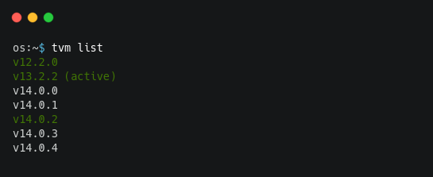
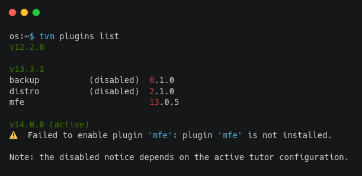

#####################
Tutor Version Manager
#####################

TVM as a version manager for tutor, this allows you to install and use different versions of tutor via the command line. 
    

.. contents:: **Table of contents**
   :depth: 1
   :local:
   :backlinks: none

Manage a tutor version
-----------------------

**Install a tutor version**

To install tutor you have to call ``tvm install v<TUTOR_VERSION>``

.. code-block:: bash  
    
    tvm install v13.2.2
    tvm install v12.2.0

If you don't know which are the tutor versions, you can use ``tvm list``

**Uninstall a tutor version**

To uninstall tutor you have to call ``tvm uninstall v<TUTOR_VERSION>``

Check tutor versions
--------------------

If you want to list or check the installed versions use the command ``tvm list``, which shows you a complete list of all available tutor versions and highlights installed version(s) and the active one.

    
    
**Flags**

- Limit results to the latest versions ``--limit <number>`` or ``-l <number>``

.. code-block:: bash
    
    tvm list -l 10
    tvm list --limit 5

Switching between tutor versions
--------------------------------
To switch between tutor versions you should call ``tvm use v<TUTOR_VERSION_INSTALLED>``

.. code-block:: bash
    
    # Switch between installed versions
    tvm use v12.2.0
    tvm use v14.0.0
 
    
Configure TVM variables 
-----------------------

**Save TVM variables**

To set ``TUTOR_ROOT`` and ``TUTOR_PLUGINS_ROOT`` variables you should call

.. code-block:: bash
    
    # Use the current working directory
    
    # TUTOR_ROOT = Current Working Directory
    # TUTOR_PLUGINS_ROOT = TUTOR_ROOT/plugins
    
    tvm config save .
    
    # Specify the path
    
    # TUTOR_ROOT = /home/user/tutor-test
    # TUTOR_PLUGINS_ROOT = TUTOR_ROOT/plugins
    
    tvm config save /home/user/tutor-test
    
**Note:**  ``TUTOR_ROOT`` and ``TUTOR_PLUGINS_ROOT`` must be absolute paths. 
    
- If you want to set a different TUTOR_PLUGINS_ROOT you should use the flag  ``--plugins-root="PATH"``

.. code-block:: bash
    
    # set a different TUTOR_PLUGINS_ROOT
    
    # TUTOR_ROOT = Current Working Directory
    # TUTOR_PLUGINS_ROOT = PATH
    
    tvm config save . --plugins-root="/home/user/tutor-test/plugins"

**Remove TVM variables**

Use command ``tvm config clear`` to remove the actual configuration of ``TUTOR_ROOT`` and ``TUTOR_PLUGINS_ROOT`` 

Manage a plugin in the current tutor version
------------------------------------------------

**Install a tutor plugin**

To install a tutor plugin in the current tutor version you should call ``tvm plugins install <PLUGIN_NAME/or/PLUGIN_LOCAL_PATH/or/PLUGIN_REPO>``

.. code-block:: bash
    
    tvm plugins install tutor-plugin
    tvm plugins install /home/user/tutor-plugin
    tvm plugins install git+https://github.com/user/tutor-plugin@vx.x.x
    
    
**List a tutor plugin**

List installed plugins by tutor version with ``tvm plugins list``, you can check the name, version and if the plugin is enabled/disabled (**the disabled notice depends on the active tutor configuration**).

**Uninstall a tutor plugin**

To uninstall a tutor plugin in the current tutor version you should call ``tvm plugins uninstall <PLUGIN_NAME>``

.. code-block:: bash
    
    tvm plugins uninstall tutor-plugin
    
